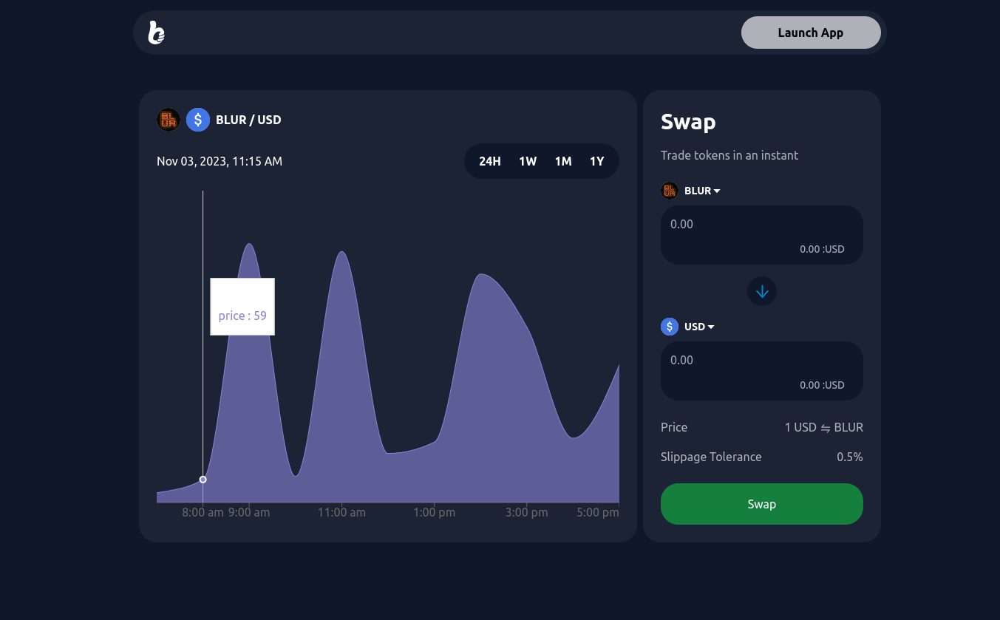

# Bito TOken Converter by OYELEKE ISREAL TIMILEHIN



- [Description](#Description)
- [Key Features](#key-features)
- [Technologies used](#technologies-used)
- [Configuration and Setup](#configuration-and-setup)
- [Usage](#Usage)

## Description

The Currency Swap Form is a web application that allows users to swap assets from one currency to another. This form provides an intuitive and visually attractive interface for users to perform currency swaps seamlessly. Users can input the desired currencies, the amount to be swapped, and receive real-time exchange rate information.

## Key Features

- Currency Selection: Users can select the currencies they want to swap.
- Amount Input: Users can input the amount they want to swap.
- Real-time Exchange Rate: Display real-time exchange rate information based on user input.
- Token Images: Visual representation of selected tokens using token images from the Switcheo repository.
- Input Validation: Interactive form validation and error messages for user-friendly experience.
- Responsive Design: Ensures the form is accessible and functional across various devices and screen sizes.

## Technologies used

The Customizer is built using the following technologies:

- React
- Typescript
- Framer Motion
- Valtio
- Tailwindcss
- recharts

## Configuration and Setup

In order to run this project locally, simply fork and clone the repository or download as zip and unzip on your machine.

- Open the project in your prefered code editor.
- Go to terminal -> New terminal (If you are using VS code)

```
$ cd client
$ npm install or yarn install (to install client-side dependencies)
$ npm start (to start the client)
```

## Usage

To use the Customizer, follow these steps:

1. Navigate to `http://localhost:3000` in your web browser.
2. Select the currencies you want to swap from and to.
3. Input the amount you wish to swap.
4. View the real-time exchange rate and token images for the selected currencies.
5. Submit the form to complete the currency swap transaction.

## Contributing

Contributions to the Customizer are welcome. If you find a bug or have a feature request, please open an issue or submit a pull request.

## License

The Customizer is licensed under the MIT License.
